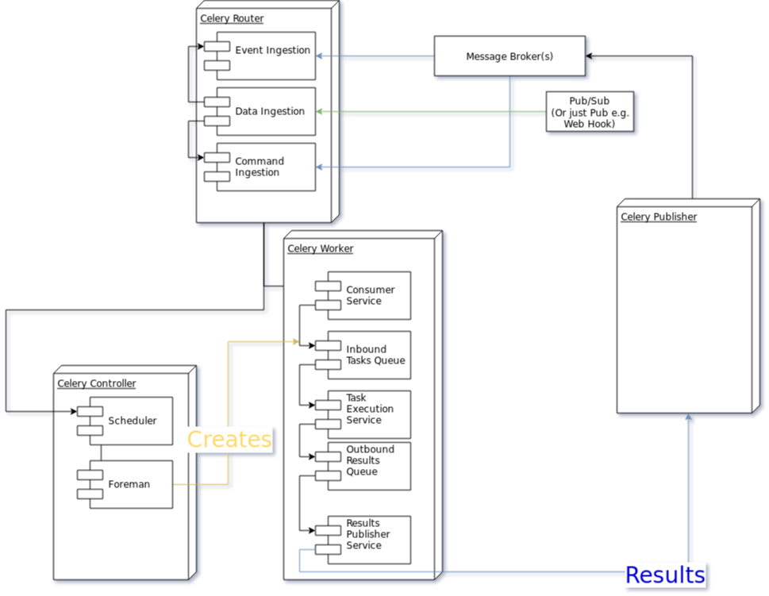

==========================================
CEP XXXX: Celery 5 High Level Architecture
==========================================

:CEP: XXXX
:Author: Omer Katz
:Implementation Team: Omer Katz
:Shepherd: Omer Katz
:Status: Draft
:Type: Informational
:Created: 2019-04-08
:Last-Modified: 2019-04-08

.. contents:: Table of Contents
   :depth: 4
   :local:

Abstract
========

When Celery was conceived, production environments were radically different from today.

Nowadays most applications are (or should be):

* Deployed to a cloud provider's computing resources.
* Distributed (sometimes between data centers).
* Available or Consistent (We must pick one according to `CAP theorem`_).
* Network Partition Tolerant.
* Observable.
* Built with scalability in mind.
* Cloud Native - The application's lifecycle is managed using Kubernetes, Swarm or any other scheduler.

In addition, Celery lacks proper support for large scale deployments and some useful messaging architectural patterns.

Celery 5 is the next major version of Celery and so we are able to break backwards compatibility, even in major ways.

As such, our next major version should represent a paradigm shift in the way we implement our task execution platform.

Specification
=============

.. note::

  The code examples below are for illustration purposes only.

  Unless explicitly specified, The API will be determined in other CEPs.

  High Level Architecture Diagram

Glossary
--------

.. glossary::

  Message Broker
    `Enterprise Integration Patterns`_ defines a `Message Broker`_ as an architectural
    building block that can receive :term:`messages <Message>` from
    multiple destinations, determine the correct destination and route the message
    to the correct channel.

  Message
    `Enterprise Integration Patterns`_ defines a `Message`_ as  data record that
    the messaging system can transmit through a message channel.

  Command Message
    `Enterprise Integration Patterns`_ defines a `Command Message`_ as a
    :term:`Message` which instructs a worker to execute a task.

  Event Message
    `Enterprise Integration Patterns`_ defines an `Event Message`_ as a
    :term:`Message` which indicates that an event has occurred.

  Document Message
    `Enterprise Integration Patterns`_ defines a `Document Message`_ as a
    :term:`Message` containing data from a data source.

  Service Activator
    `Enterprise Integration Patterns`_ defines a `Service Activator`_ as a
    one-way (request only) or two-way (request-reply) adapter between the
    :term:`Message` and the service it invokes.
    The service can be a simple as a method call.
    The activator handles all of the messaging details and invokes the service
    like any other client, such that the service doesn’t even know it’s being
    invoked through messaging.

  Idempotent Receiver
    `Enterprise Integration Patterns`_ defines an `Idempotent Receiver`_ as a
    component that can safely receive the same message multiple times
    but will produce the same side effects when facing duplicated messages.

  Message Dispatcher

    `Enterprise Integration Patterns`_ defines a `Message Dispatcher`_ as a
    component that will consume messages from a channel and distribute them to
    performers.

  Circuit Breaker
    Martin Fowler defines a `Circuit Breaker`_ in the following fashion:

      The basic idea behind the circuit breaker is very simple.
      You wrap a protected function call in a circuit breaker object, which monitors
      for failures.
      Once the failures reach a certain threshold, the circuit breaker trips,
      and all further calls to the circuit breaker return with an error,
      without the protected call being made at all.
      Usually you'll also want some kind of monitor alert if the circuit breaker
      trips.

  CAP Theorem
    TODO

  Availability
    TODO

  Fault Tolerance
    TODO

  Network Resilience
    According to Wikipedia `Network Resilience`_ is:

      In computer networking: resilience is the ability to provide and maintain
      an acceptable level of service in the face of faults and challenges to
      normal operation.”
      Threats and challenges for services can range from simple misconfiguration
      over large scale natural disasters to targeted attacks.
      As such, network resilience touches a very wide range of topics.
      In order to increase the resilience of a given communication network,
      the probable challenges and risks have to be identified
      and appropriate resilience metrics have to be defined
      for the service to be protected.

  Consistency
    TODO

  Network Partition Tolerance
    TODO

  Monitoring
    According to `fastly`_ monitoring is:

      The activity of observing the state of a system over time.
      It uses instrumentation for problem detection, resolution,
      and continuous improvement.
      Monitoring alerts are reactive–they tell you when a known issue has
      already occurred
      (i.e. maybe your available memory is too low or you need more compute).
      Monitoring provides automated checks that you can execute against a
      distributed system to make sure that none of the things you predicted
      signify any trouble.
      While monitoring these known quantities is important,
      the practice also has limitations, including the fact that you are only
      looking for known issues. Which begs an important question,
      “what about the problems that you didn’t predict?”

  Observability
    According to Wikipedia in the context of control theory `Observability`_ is:

      In control theory, observability is a measure of how well internal states
      of a system can be inferred from knowledge of its external outputs.

    In the context of distributed systems observability is a super-set of
    :term:`monitoring`.

    According to `fastly`_ the three pillars of observability are:

      Logs: Logs are a verbose representation of events that have happened.
      Logs tell a linear story about an event using string processing
      and regular expressions.
      A common challenge with logs is that if you haven’t properly indexed
      something, it will be difficult to find due to the sheer volume of
      log data.
      Traces: A trace captures a user’s journey through your application.
      Traces provide end-to-end visibility and are useful when you need to
      identify which components cause system errors, find performance
      bottlenecks, or monitor flow through modules.
      Metrics: Metrics can be either a point in time or monitored over
      intervals.
      These data points could be counters, gauges, etc.
      They typically represent data over intervals, but sometimes sacrifice
      details of an event in order to present data that is easier to assimilate.

  Structured Logging
    Structured Logging is a method to make log messages easy to process
    by machines.
    A usual log message is a timestamp, level and a message string.
    The context describing the logged event is embedded inside the message
    string.
    A structured log message store their context in a predetermined message
    format which allows machines to parse them more easily.

  JSON
    JSON stands for JavaScript Object Notation, which is a way to format data so
    that it can be transmitted from one place to another, most commonly between
    a server and a Web application.

  stdout
    Stdout, also known as standard output, is the default file descriptor
    where a process can write output.

  Service Locator
    Martin Fowler defines a `Service Locator`_ in the following fashion:

      The basic idea behind a service locator is to have an object that knows
      how to get hold of all of the services that an application might need.
      So a service locator for this application would have a method that returns
      a movie finder when one is needed.

  GIL
    The Global Interpreter Lock, abbreviated as the `GIL`_ is a mutex which
    prevents executing threads in parallel if both are about to execute a python
    bytecode.

    This is by design since Python has many atomic operations and maintaining
    individual locks on each object results in slower execution.

    Depending on the implementation, a thread may be forced to release the `GIL`_
    when a condition is met. In CPython's implementation of Python 3,
    a thread is forced to release the `GIL`_ after a it executes for a period of
    time.

    A thread may also release the `GIL`_ voluntarily when it uses a system call
    or when a C extension instructs to do so.

  IPC
    According to Wikipedia `Inter-process Communication`_:

      refers specifically to the mechanisms an operating system provides to allow
      the processes to manage shared data.
      Typically, applications can use IPC, categorized as clients and servers,
      where the client requests data and the server responds to client requests.
      Many applications are both clients and servers, as commonly seen in
      distributed computing.

      There are many `approaches <https://en.wikipedia.org/wiki/Inter-process_communication#Approaches>`_
      to IPC. Some of them are available in all operating systems, some are
      only available in specific operating systems.

  Task
    A task is a unit of business logic that is completely independent and can be
    executed regardless of the execution platform.

  Domain Model
    Martin Fowler defines a `Domain Model`_ in the following fashion:

      An object model of the domain that incorporates both behavior and data.

  Domain Event
    Martin Fowler defines a `Domain Event`_ in the following fashion:

      I go to Babur's for a meal on Tuesday, and pay by credit card.
      This might be modeled as an event, whose event type is 'make purchase',
      whose subject is my credit card, and whose occurred date is Tuesday.
      If Babur's uses an old manual system and doesn't transmit the transaction
      until Friday, the noticed date would be Friday.

      Things happen. Not all of them are interesting, some may be worth
      recording but don't provoke a reaction.
      The most interesting ones cause a reaction.
      Many systems need to react to interesting events.
      Often you need to know why a system reacts in the way it did.

      By funneling inputs to a system into streams of Domain Event you can keep
      a record of all the inputs to a system.
      This helps you organize your processing logic, and also allows you to keep
      an audit log of the inputs to the system.

Message Types
-------------

In relation to Celery :term:`Command messages <Command Message>`
are the messages we publish to the :term:`Message Broker` whenever we want to
execute a :term:`Task`.

:term:`Document messages <Document Message>` are the messages we get as a result.

:term:`Document messages <Document Message>` may also be produced whenever
we publish a serialized representation of a :term:`Domain Model`.

.. code-block:: pycon

  >>> from celery import task
  >>> @task
  ... def add(a, b):
  ...   return a + b
  >>> result = add.delay(1, 2)  # Publish a command message
  >>> result.get()  # Consume a Document message
  3

:term:`Event messages <Event Message>` are a new concept for Celery.
They describe that a :term:`Domain Event` occurred.
Multiple tasks can be subscribed to an event.

.. code-block:: pycon

  >>> from uuid import UUID
  >>> from celery import task, event
  >>> from myapp.models import User, AccountManager
  >>> @task
  ... def send_welcome_email(user_id, email):
  ...   send_email(email=email, contents="hello, welcome", subject="welcome") # Send a welcome email to the user...
  ...   User.objects.filter(pk=user_id).update(welcome_email_sent=True)
  >>> @task
  ... def notify_account_manager(user_id, email):
  ...   account_manager = AccountManager.objects.assign_account_manager(user_id)
  ...   send_email(email=account_manager.email, contents="you have a new user to attend to", subject="Alert") # Send an email to the account manager...
  >>> @event
  ... class UserRegistered:
  ...   user_id: UUID
  ...   email: str
  >>> UserRegistered.subscribe(send_welcome_email)
  >>> UserRegistered.subscribe(notify_account_manager)
  >>> UserRegistered.delay(user_id=1, email='foo@bar.com')  # Calls both send_welcome_email and notify_account_manager with the provided arguments.

These architectural building blocks will aid us in creating a better messaging
system. To encourage `ubiquitous language`_, we will be using them in this
document and in Celery 5's codebase as well.

Canvas
------

In Celery Canvas is the mechanism which users can use to define workflows
dynamically.

In previous versions of Celery there are issues with the protocol which can
cause Celery to generate very large messages.
There are also issues with the API and multiple implementation problems.

In Celery 5 we're going to revamp the protocol, API and
possibly the implementation itself to resolve these issues.

Signatures
++++++++++

Primitives
++++++++++

Error Handling
~~~~~~~~~~~~~~

Error Recovery
~~~~~~~~~~~~~~

Chains
~~~~~~

Groups
~~~~~~

Chords
~~~~~~

Maps
~~~~

Starmaps
~~~~~~~~

Chunks
~~~~~~

Forks
~~~~~

Workflows
---------

A Workflow is a declarative :ref:`draft/celery-5-high-level-architecture:Canvas`.

Workflows provide an API for incrementally executing business logic by
dividing it to small, self-contained tasks.

Unlike :ref:`draft/celery-5-high-level-architecture:Canvas`, a Workflow is
immutable, static and predicable.

Observability
-------------

One of Celery 5's goals is to be :term:`observable <Observability>`.

Each Celery component will record statistics, provide trace points for
application monitoring tools and distributed tracing tools and emit log messages
when appropriate.

Metrics
+++++++

Celery stores and publishes metrics which allows our users to debug their
applications more easily and spot problems.

By default each worker will publish the metrics to a dedicated queue.

Other methods such as publishing them to StatsD is also possible using the
provided extension point.

Trace Points
++++++++++++

Celery provides trace points for application monitoring tools and distributed
tracing tools.

This allows our users to spot and debug performance issues.

Logging
+++++++

All log messages must be structured.
:term:`Structured logs <Structured Logging>` provide context for our users
which allows them to debug problems more easily and aids the developers
to resolve bugs in Celery.

The structure of a log message is determined whenever a component
is initialized.

During initialization, an attempt will be made to detect how the component
lifecycle is managed.
If all attempts are unsuccessful, the logs will be formatted using
:term:`JSON` and will be printed to stdout.

Celery will provide an extension point for detection of different
runtimes.

.. admonition:: Example

  If a component's lifecycle is managed by a SystemD service,
  Celery will detect that the `JOURNAL_STREAM`_ environment variable
  is set when the process starts and use it's value to transmit structured
  data into `journald`_.

Whenever Celery fails to log a message for any reason it publishes a command
to the worker's :ref:`draft/celery-5-high-level-architecture:Inbox Queue`
in order to log the message again.
As usual messages which fail to be published are stored in the
:ref:`draft/celery-5-high-level-architecture:messages backlog`.

In past versions of Celery we've used the standard logging module.
Unfortunately it does not meet the aforementioned requirements.

`Eliot <https://github.com/itamarst/eliot>`_ is a logging library which provides
structure and context to logs, even across coroutines, threads and processes.

It is also able to emit logs to `journald`_ and has native trio integration.

Network Resilience and Fault Tolerance
--------------------------------------

Celery 5 aims to be network failure resilient and fault tolerant.
As an architectural guideline Celery must retry operations **by default**
and must avoid doing so **indefinitely and without proper limits**.

Any operation which cannot be executed either momentarily or permanently
as a result of a bug must not be retried beyond the configured limits.
Instead, Celery must store the operation for further inspection
and if required, manual intervention.

Celery must track and automatically handle "poisonous messages" to ensure
the recovery of the Celery cluster.

Fault Tolerance
+++++++++++++++

Distributed Systems suffer from an inherent property:

  Any distributed system is unreliable.

  * The network may be unavailable or slow.
  * Some or all of the servers might suffer from a hardware failure.
  * A node in the system may arbitrarily crash
    due to lack of memory or a bug.
  * Any number of unaccounted failure modes.

Therefore, Celery must be fault tolerant and gracefully degrade its' operation
when failures occur.

Graceful Degradation
~~~~~~~~~~~~~~~~~~~~

Features which are less mission-critical may fail at any time, provided that
a warning is logged.

This document will highlight such features and describe what happens when
they fail for any reason.

Retries
~~~~~~~

In previous Celery versions tasks were not retried by default.

This forces new adopters to carefully read our documentation to ensure
the fault tolerance of their tasks.

In addition, our retry policy was declared at the task level.
When using :ref:`celery4:task-autoretry` Celery automatically retries tasks
when specific exceptions are raised.

However the same type of exception may hold a different meaning in different
contexts.

This created the following pattern:

.. code-block:: python

  from celery import task
  from data_validation_lib import validate_data

  def _calculate(a, b):
    # Do something

  @task(autoretry_for=(ValueError,))
  def complex_calculation(a, b):
    try:
      # Code that you don't control can raise a ValueError.
      validate_data(a, b)
    except ValueError:
      print("Complete failure!")
      return

    # May temporarily raise a ValueError due to some externally fetched
    # data which is currently incorrect but will be updated later.
    _calculate()

An obvious way around this problem is to ensure that `_calculate()`
raises a custom exception.

But we shouldn't force the users to use workarounds. Our code should be
ergonomic and idiomatic.

Instead, we should allow users to declare sections as "poisonous" - tasks that
if retried will surely fail if they fail at those sections.

.. code-block:: python

  from celery import task, poisonous
  from data_validation_lib import validate_data

  def _calculate(a, b):
    # Do something

  @task(autoretry_for=(ValueError,))
  def complex_calculation(a, b):
    with poisonous():
      validate_data(a, b)

    # May temporarily raise a ValueError due to some externally fetched
    # data which is currently incorrect but will be updated later.
    _calculate()

Not all operations are equal. Some may be retried more than others.
Some may need to be retried less often.

Currently there are multiple ways to achieve this:

You can separate them to different tasks with a different retry policy:

.. code-block:: python

  from celery import task

  @task(retry_policy={
    'max_retries': 3,
    'interval_start': 0,
    'interval_step': 0.2,
    'interval_max': 0.2
  })
  def foo():
    second_operation()

  @task(retry_policy={
    'max_retries': 10,
    'interval_start': 0,
    'interval_step': 5,
    'interval_max': 120
  })
  def bar():
    first_operation()
    foo.delay()

Or you can wrap each code section in a try..except clause and call
:py:meth:`celery.app.task.Task.retry`.

.. code-block:: python

  @task(bind=True)
  def foo(self):
    try:
      # first operation
    except Exception:
      self.retry(retry_policy={
        'max_retries': 10,
        'interval_start': 0,
        'interval_step': 5,
        'interval_max': 120
      })

    try:
      first_operation()
    except Exception:
      self.retry(retry_policy={
        'max_retries': 10,
        'interval_start': 0,
        'interval_step': 5,
        'interval_max': 120
      })

    try:
      second_operation()
    except Exception:
      self.retry(retry_policy={
        'max_retries': 3,
        'interval_start': 0,
        'interval_step': 0.2,
        'interval_max': 1
      })

Those solutions are unnecessarily verbose. Instead, we could use a with clause
if all we want to do is retry.

.. code-block:: python

  @task
  def foo():
    with retry(max_retries=10, interval_start=0, interval_step=5, interval_max=120):
      first_operation()

    with retry(max_retries=3, interval_start=0, interval_step=0.2, interval_max=1):
      second_operation()

By default messages which cannot be re-published will be stored
in the :ref:`draft/celery-5-high-level-architecture:messages backlog`.

Implementers may provide other fallbacks such as executing the retried task
in the same worker or abandoning the task entirely.

Some operations are not important enough to be retried if they fail.

.. admonition:: Example

  We're implementing a BI system that records mouse
  interactions.

  The BI team has specified that it wants to store the raw data and
  the time span between interactions.
  Since we have a lot of data already, if the system failed to insert the raw data
  into the data store then we should not fail. Instead, we should emit a warning.
  However, the time span between mouse interactions is critical to the BI
  team's insight and if that fails to be inserted into the data store
  we must retry it.

Such a task can be defined using the ``optional`` context manager.

.. code-block:: python

  @task
  def foo(raw_data):
    # Using default retry policy
    with optional():
      # ignore retry policy and proceed
      insert_raw_data(raw_data)

    with retry(max_retries=10, interval_start=0, interval_step=5, interval_max=120):
      calculation = time_span_calculation(raw_data)
      insert_time_spans(calculation)

In case of a failure inside the optional context manager, a warning is logged.

We can of course be more specific about the failures we allow:

.. code-block:: python

  @task
  def foo(raw_data):
    # Using default retry policy
    with optional(ConnectionError, TimeoutError):
      # ignore retry policy and proceed
      insert_raw_data(raw_data)

    with retry(max_retries=10, interval_start=0, interval_step=5, interval_max=120):
      calculation = time_span_calculation(raw_data)
      insert_time_spans(calculation)

Health Checks
~~~~~~~~~~~~~

Health Checks are used in Celery to verify that a worker is able to
successfully execute a :ref:`task <draft/celery-5-high-level-architecture:Tasks>`
or a :ref:`service <draft/celery-5-high-level-architecture:Services>`.

The :ref:`draft/celery-5-high-level-architecture:Scheduler` is responsible
for scheduling the health checks for execution in each worker after
each time the configured period of time lapses.

Whenever a health check should be executed the
:ref:`draft/celery-5-high-level-architecture:Scheduler` instructs the
:ref:`draft/celery-5-high-level-architecture:Publisher` to send the
`<health check name>_expired` :term:`Event Message` to each worker's
:ref:`draft/celery-5-high-level-architecture:Inbox Queue`.

Workers which have tasks subscribed to the event will
execute all the subscribed tasks in order to determine the state of the
health check.

Health Checks can handle :term:`Document Messages <Document Message>` as input
from :ref:`draft/celery-5-high-level-architecture:Data Sources`.

This is useful when you want to respond to an alert from a monitoring system
or when you want to verify that all incoming data from said source is
valid at all times before executing the task.

In addition to tasks, Health Checks can also use
:ref:`draft/celery-5-high-level-architecture:Services` in order to track
changes in the environment it is running on.

.. admonition:: Example

  We have a task which requires 8GB of memory to complete.
  The worker runs a service which constantly monitors the system's available
  memory.
  If there is not enough memory it changes the task's health check to the
  **Unhealthy** state.

If a task or a service that is part of a health check fails unexpectedly it
is ignored and an error message is logged.

Celery provides many types of health checks in order to verify that it can
operate without any issues.

Users may implement their own health checks in addition to the built-in health
checks.

Some health checks are specific to the worker they are executing on.
Therefore, their state is stored in-memory in the worker.

Other health checks are global to all or a group of workers.
As such, their state is stored externally.

If the state storage for health checks is not provided, these health checks
are disabled.

Health Checks can be associated with tasks in order to ensure that they are
likely to succeed. Multiple Health Check failures may trigger
a :term:`Circuit Breaker` which will prevent the task from running for a period
of time or automatically mark it as failed.

Each Health Check declares its possible states.
Sometimes it makes sense to try to execute a task anyway even if the
health check occasionally fails.

.. admonition:: Example

  A health check that verifies whether we can send a HTTP request to an endpoint
  has multiple states.

  The health check performs an
  `OPTIONS <https://developer.mozilla.org/en-US/docs/Web/HTTP/Methods/OPTIONS>`_
  HTTP request to that endpoint and expects it to respond within the specified
  timeout.

  The health check is in a **Healthy** state if all the following conditions are
  met:

  * The DNS server is responding within the specified time limit and is
    resolving the address correctly.
  * The TLS certificates are valid and the connection is secure.
  * The Intrusion Detection System reports that the network is secure.
  * The HTTP method we're about to use is listed in the OPTIONS response's
    `ALLOW <https://developer.mozilla.org/en-US/docs/Web/HTTP/Headers/Allow>`_
    header.
  * The content type we're about to format the request in is listed in the
    OPTIONS response's
    `ACCEPT <https://developer.mozilla.org/en-US/docs/Web/HTTP/Headers/Accept>`_
    header.
  * The OPTIONS request responds within the specified time limits.
  * The OPTIONS request responds with
    `200 OK <https://developer.mozilla.org/en-US/docs/Web/HTTP/Status/200>`_
    status.

  In addition, the actual request performed in the task must also stand in the
  aforementioned conditions. Otherwise, the health check will change it's state.

  The health check can be in an **Insecure** state if one or more of the
  following conditions are met:

  * The TLS certificates are invalid for any reason.
  * The Intrusion Detection System has reported that the network is compromised
    for any reason.

  It is up for the user to configure the :term:`Circuit Breaker` to prevent
  insecure requests from being executed.

  The health check can be in an **Degraded** state if one or more of the
  following conditions are met:

  * The request does not reply with a 2xx HTTP status.
  * The request responds slowly and almost reaches it's time limits.

  It is up for the user to configure the :term:`Circuit Breaker` to prevent
  requests from being executed after multiple attempts or not all.

  The health check can be in an **Unhealthy** state if one or more of the
  following conditions are met:

  * The request responds with a 500 HTTP status.
  * The request's response has not been received within the specified time
    limits.

  It is up for the user to configure the :term:`Circuit Breaker` to prevent
  requests from being executed if there is an issue with the endpoint.

  The health check can be in an **Permanently Unavailable** state if one or more
  of the following conditions are met:

  * The request responds with a
    `404 Not Found <https://developer.mozilla.org/en-US/docs/Web/HTTP/Status/404>`_
    HTTP status.
  * The HTTP method we're about to use is not allowed.
  * The content type we're about to use is not allowed.

Circuit Breaking
~~~~~~~~~~~~~~~~

Celery 5 introduces the concept of :term:`Circuit Breaker` into the framework.

A Circuit Breaker prevents a :ref:`task <draft/celery-5-high-level-architecture:Tasks>`
or a :ref:`service <draft/celery-5-high-level-architecture:Services>`
from executing.

Each task or a service has a Circuit Breaker which the user can associate
health checks with.

In addition, if the task or the service unexpectedly fails, the user
can configure the Circuit Breaker to trip after a configured number of times.
The default value is 3 times.

Whenever a Circuit Breaker trips, the worker will emit a warning log message.

After a configured period of time the circuit is opened again and tasks may
execute. The default period of time is 30 seconds with no linear or exponential
growth.

The user will configure the following properties of the Circuit Breaker:

* How many times the health checks may fail before
  the circuit breaker trips.
* How many unexpected failures the task or service tolerates before tripping
  the Circuit Breaker.
* The period of time after which the circuit is yet
  again closed. That time period may grow linearly or exponentially.
* How many circuit breaker trips during a period of time should cause the worker
  to produce an error log message instead of a warning log message.
* The period of time after which the circuit breaker downgrades
  it's log level back to warning.

.. admonition:: Example

  We allow 2 **Unhealthy** health checks
  and/or 10 **Degraded** health checks in a period of 10 seconds.

  If we cross that threshold, the circuit breaker trips.

  The circuit will be closed again after 30 seconds. Afterwards, the task can
  be executed again.

  If 3 consequent circuit breaker trips occurred during a period of 5 minutes,
  all circuit breaker trips will emit an error log message instead of a warning.

  The circuit breaker will downgrade it's log level after 30 minutes.

Network Resilience
++++++++++++++++++

Network Connections may fail at any time.
In order to be network resilient we must use retries and circuit breakers on
all outgoing and incoming network connections.

In addition, proper timeouts must be set to avoid hanging when the connection
is slow or unresponsive.

Each network connection must be accompanied by a
:ref:`health check <draft/celery-5-high-level-architecture:Health Checks>`.

Health check failures must eventually trip a
:ref:`circuit breaker <draft/celery-5-high-level-architecture:Circuit Breaking>`.

Command Line Interface
----------------------

Our command line interface is the user interface to all of Celery's
functionality. It is crucial for us to provide an excellent user experience.

Currently Celery uses :mod:`argparse` with a few custom hacks and workarounds for
things which are not possible to do with :mod:`argparse`.
This created some bugs in the past.

Celery 5 will use `Click`_, a modern Python library for creating command line
programs.

Click's documentation `explains <https://click.palletsprojects.com/en/7.x/why>`_
why it is a good fit for us:

  There are so many libraries out there for writing command line utilities;
  why does Click exist?

  This question is easy to answer: because there is not a single command
  line utility for Python out there which ticks the following boxes:

  * is lazily composable without restrictions
  * supports implementation of Unix/POSIX command line conventions
  * supports loading values from environment variables out of the box
  * supports for prompting of custom values
  * is fully nestable and composable
  * works the same in Python 2 and 3
  * supports file handling out of the box
  * comes with useful common helpers (getting terminal dimensions,
    ANSI colors, fetching direct keyboard input, screen clearing,
    finding config paths, launching apps and editors, etc.)

  There are many alternatives to Click and you can have a look at them if
  you enjoy them better.  The obvious ones are ``optparse`` and ``argparse``
  from the standard library.

  Click actually implements its own parsing of arguments and does not use
  ``optparse`` or ``argparse`` following the ``optparse`` parsing behavior.
  The reason it's not based on ``argparse`` is that ``argparse`` does not
  allow proper nesting of commands by design and has some deficiencies when
  it comes to POSIX compliant argument handling.

  Click is designed to be fun to work with and at the same time not stand in
  your way.  It's not overly flexible either.  Currently, for instance, it
  does not allow you to customize the help pages too much. This is intentional
  because Click is designed to allow you to nest command line utilities.  The
  idea is that you can have a system that works together with another system by
  tacking two Click instances together and they will continue working as they
  should.

  Too much customizability would break this promise.

Click describes it's
`advantages over argparse <https://click.palletsprojects.com/en/7.x/why/#why-not-argparse>`_
in its documentation as well:

  Click is internally based on optparse instead of argparse.  This however
  is an implementation detail that a user does not have to be concerned
  with.  The reason however Click is not using argparse is that it has some
  problematic behaviors that make handling arbitrary command line interfaces
  hard:

  * argparse has built-in magic behavior to guess if something is an
    argument or an option.  This becomes a problem when dealing with
    incomplete command lines as it's not possible to know without having a
    full understanding of the command line how the parser is going to
    behave.  This goes against Click's ambitions of dispatching to
    subparsers.
  * argparse currently does not support disabling of interspersed
    arguments.  Without this feature it's not possible to safely implement
    Click's nested parsing nature.

In contrast to :mod:`argparse`, the `Click community <https://github.com/click-contrib>`_
provides many extensions we can use to create a better user experience
for our users.

Click supports calling `async` methods and functions
using the `trio-click <https://github.com/click-contrib/trio-click>`_ extension
which is likely to be important for us in the future.

Dependency Inversion
--------------------

Currently Celery uses different singleton registries to customize the behavior
of it's different components.
This is known as the :term:`Service Locator` pattern.

Mark Seemann criticized Service Locators as an anti-pattern for multiple reasons:

* It has `API usage problems and maintenance issues <https://blog.ploeh.dk/2010/02/03/ServiceLocatorisanAnti-Pattern/>`_.
* It `violates encapsulation <https://blog.ploeh.dk/2015/10/26/service-locator-violates-encapsulation/>`_.
* It `violates SOLID <https://blog.ploeh.dk/2014/05/15/service-locator-violates-solid/>`_.

Using constructor injection is a much better way to invert our dependencies.

For that purpose we have selected the `dependencies`_ library.

Worker
------

The Worker is the most fundamental architectural component in Celery.

The role of the Worker is to be a :term:`Service Activator`.
It executes :ref:`draft/celery-5-high-level-architecture:Tasks` in response
to :term:`messages <Message>`.

A Worker is also an :term:`Idempotent Receiver`.
If the exact same :term:`Message` is received more than once, the duplicated
messages are discarded.
In this case, a warning log message is emitted.
The Worker maintains a list of identifiers of recently received :term:`messages <Message>`.
The number of :term:`messages <Message>` is determined by the a configuration
value.
By default that value is 100 :term:`messages <Message>`.

Configuration
+++++++++++++

In previous versions of Celery we had the option to load the configuration from
a Python module.

Cloud Native applications often use `Etcd <https://etcd.io/>`_,
`Consul <https://www.consul.io/>`_
or `Kubernetes Config Maps <https://cloud.google.com/kubernetes-engine/docs/concepts/configmap>`_ (among others)
to store configuration and adjust it when needed.

Celery 5 introduces the concept of configuration backends.
These backends allow you to load the Worker's configuration from any source.

The default configuration backend loads the configuration from a Python module.

Users may create their own configuration backends to load configuration from
a `YAML <https://yaml.org/>`_ file, a `TOML <https://github.com/toml-lang/toml>`_ file
or a database.

Once the configuration has changed, the Worker stops consuming tasks,
waits for all other tasks to finish and reloads the configuration.

This behavior can be disabled using a CLI option.

Event Loop
++++++++++

In Celery 4 we have implemented our own custom Event Loop.
It is a cause for many bugs and issues in Celery.

In addition, some I/O operations are still blocking the event loop since
the clients we use do not allow non-blocking operations.

The most important feature of Celery 5 is to replace the custom Event Loop
with `Trio`_.

We selected it because of it's
`design <https://trio.readthedocs.io/en/latest/design.html>`_,
`interoperability with asyncio <https://github.com/python-trio/trio-asyncio>`_
and it's many features.

Trio provides a context manager which limits the concurrency of coroutines
and/or threads. This saves us from further bookkeeping when a Worker executes
:ref:`draft/celery-5-high-level-architecture:Tasks`.

Trio allows coroutines to report their status. This is especially useful
when we want to block the execution of other coroutines until initialization
of the coroutine completes. We require this feature for implementing
:ref:`draft/celery-5-high-level-architecture:Boot Steps`.

Trio also provides a feature called cancellation scopes which allows us to
cancel a coroutine or multiple coroutines at once.
This allows us to abort :ref:`draft/celery-5-high-level-architecture:Tasks`
and handle the aborted tasks in an idiomatic fashion.

All of those features save us from writing a lot of code. If we were to select
asyncio as our Event Loop, we'd have to implement most of those features
ourselves.

Internal Task Queue
+++++++++++++++++++

The internal task queue is an in-memory priority queue which the worker uses
to queue tasks for execution.

The queue must be thread-safe and coroutine-safe.

Internal Results Queue
++++++++++++++++++++++

The internal results queue is an in-memory priority queue which the worker uses
to report the result of tasks back to the
:ref:`draft/celery-5-high-level-architecture:Router`.

The queue must be thread-safe and coroutine-safe.

Services
++++++++

Services are stateful, long running tasks which are used by Celery to perform
its internal operations.

Some services publish :term:`messages <Message>` to brokers,
others consume :term:`messages <Message>` from them.
Other services are used to calculate optimal scheduling of tasks, routing,
logging and even executing tasks.

Users may create their own services as well.

Internal Services
+++++++++++++++++

The Worker defines internal services to ensure it's operation and to provide
support for it's features.

The exact API for each service will be determined in another CEP.

This list of internal services is not final.
Other internal services may be defined in other CEPs.

Task Execution
~~~~~~~~~~~~~~

The ``Task Execution`` service is responsible for executing all Celery
:ref:`tasks <draft/celery-5-high-level-architecture:Tasks>`.

It consumes tasks from the
:ref:`draft/celery-5-high-level-architecture:Internal Task Queue`,
executes them and enqueues the results into the
:ref:`draft/celery-5-high-level-architecture:Internal Results Queue`.

The service supervises how many tasks are run concurrently and limits the
number of concurrent tasks to the configured amount.

The service also attempts to saturate all of the available resources by
scheduling as many as :ref:`draft/celery-5-high-level-architecture:I/O Bound Tasks`
and :ref:`draft/celery-5-high-level-architecture:CPU Bound Tasks` as possible.

Consumer
~~~~~~~~

The ``Consumer`` service consumes :term:`messages <Message>` from one or many
:ref:`Routers <draft/celery-5-high-level-architecture:Router>` or
:term:`Message Brokers <Message Broker>`.

The service enqueues the consumed :term:`messages <Message>`
into the :ref:`draft/celery-5-high-level-architecture:Internal Task Queue`.

Result Publisher
~~~~~~~~~~~~~~~~

The ``Result Publisher`` service consumes results from the
:ref:`draft/celery-5-high-level-architecture:Internal Results Queue` and
publishes them to the :ref:`draft/celery-5-high-level-architecture:Router`'s
:ref:`draft/celery-5-high-level-architecture:Inbox Queue`.

Tasks
+++++

Tasks are short running, have a defined purpose and are triggered in response
to messages.

Celery declares some tasks for internal usage.

Users will create their own tasks for their own use.

Deduplication
~~~~~~~~~~~~~

Some Tasks are not idempotent and may not run more than once.

Users may define a deduplication policy to help Celery discard duplicated
messages.

.. admonition:: Example

  The ``send_welcome_email`` task is only allowed to send one welcome email per
  user.

  The user defines a deduplication policy which checks with their 3rd party
  email delivery provider if that email has already been sent.
  If it did, the user instructs Celery to reject the task.

I/O Bound Tasks
~~~~~~~~~~~~~~~

I/O bound tasks are tasks which mainly perform a network operation or
a disk operation.

I/O bound tasks are specifically marked as such using Python's `async def`
notation for defining awaitable functions. They will run in a Python coroutine.

Due to that, any I/O operation in that task must be asynchronous in order to
avoid blocking the event loop.

Some of the user's asynchronous tasks won't use trio as their event loop
but will use the more commonly used asyncio event loop which we do support.

In that case, the user must specify the event loop they are going to use for the
task.

CPU Bound Tasks
~~~~~~~~~~~~~~~

CPU bound tasks are tasks which mainly perform a calculation of some sort such
as calculating an average, hashing, serialization or deserialization,
compression or decompression, encryption or decryption etc.
In some cases where no asynchronous code for the I/O operation is available
CPU bound tasks are also an appropriate choice as they will not block
the event loop for the duration of the task.

Performing operations which release the :term:`GIL` is recommended to avoid
throttling the concurrency of the worker.

CPU bound tasks are specifically marked as such using Python's
`def` notation for defining functions. They will run in a Python thread.

Using threads instead of forking the main process has its upsides:

- It simplifies the Worker's architecture and makes it less brittle.

  Processes require :term:`IPC` to communicate with each other.
  This complicates implementation since multiple methods are required to support
  :term:`IPC` reliably across all operating systems Celery supports.
  Threads on the other hand require less complicated means of communication.

  In `trio`_, we simply use a memory channel which is a coroutine and thread safe
  way to send and receive values.

- PyPy's JIT warms up faster.

  When using PyPy, using threads means that we get to keep our previous JIT traces
  and therefore JIT warmup will occur faster.

  If we'd use processes, each process has to warm up its own JIT which results
  in tasks being executed slower for a longer period of time.

There are also downsides to using threads for CPU bound tasks unfortunately:

- Pure Python CPU bound workloads cannot be executed in parallel.

  In both CPython and PyPy the :term:`GIL` prevents executing two Python bytecodes
  in parallel by design.

  This results in slower execution of Python code when using threads.

- The :term:`GIL`'s implementation in CPython 3.x has a defect in design.

  According to a `bug report <https://bugs.python.org/issue7946>`_ the new GIL
  in Python 3 CPU bound threads may starve I/O threads (in our case the main thread).

  .. note ::

    This is not an issue with PyPy's implementation of the `GIL`_
    `according to Armin Rigo <https://bugs.python.org/msg346495>`_, PyPy's creator.

  - Tasks are no longer isolated.

    Since we're mixing workloads to maximize our throughput a task which crashes
    the worker or leaks memory can crash the entire worker.

Boxed Tasks
~~~~~~~~~~~

To minimize the disadvantages of using threads in Python and workaround the
shortcomings of the :term:`GIL`, Celery also provides a new type of tasks called
Boxed Tasks.

Boxed Tasks are processes which execute tasks in an isolated manner.

The processes' lifecycle is managed by the :ref:`draft/celery-5-high-level-architecture:Controller`.

Since Boxed Tasks are run separately from Celery itself, the program the process
is running can be written in any language as long as it implements IPC in the
same way the :ref:`draft/celery-5-high-level-architecture:Controller` expects.

Boxed tasks are a special kind of
:ref:`draft/celery-5-high-level-architecture:I/O Bound Tasks`.
They are executed the same way inside the worker but defined using a different
API.

Concurrency Budget
~~~~~~~~~~~~~~~~~~

Each worker has a concurrency budget for each type of task it can run.

The budget for each type of task is defined by a minimal
and an optional maximal concurrency.

.. note::

	 If a user specifies a concurrency of more than 10 for :ref:`draft/celery-5-high-level-architecture:CPU Bound Tasks`
   a warning log message is emitted.
   Too many threads can cause task execution to grind down to a halt.

If there are more tasks in the :ref:`draft/celery-5-high-level-architecture:Internal Tasks Queue`
than what is currently the allowed maximum task concurrency we increase the
current maximum by that number of tasks.
After this increase, there will be a configurable cooldown period during which
the worker will execute the new tasks.
After the cooldown period, if there are still more tasks in the :ref:`draft/celery-5-high-level-architecture:Internal Tasks Queue`
than the current maximum capacity we increase the maximum concurrency exponentially
by a configurable exponent multiplied by the number of increases.
The result is rounded up.

This process goes on until we either reach the maximum concurrency budget for
that type of tasks or if the number of tasks in
:ref:`draft/celery-5-high-level-architecture:Internal Tasks Queue` is lower than
the current maximum concurrency.

If the current number of tasks is lower than the current maximal concurrency
we decrease it to the number of tasks that are currently executing.

Internal Tasks
++++++++++++++

Celery defines internal tasks to ensure it's operation and to provide
support for it's features.

The exact API for each task will be determined in another CEP.

This list of internal tasks is not final.
Other internal tasks may be defined in other CEPs.

SystemD Notify
~~~~~~~~~~~~~~

This task reports the status of the worker to the SystemD service which is
running it.

It uses the `sd_notify`_ protocol to do so.

Retry Failed Boot Step
~~~~~~~~~~~~~~~~~~~~~~

This task responds to a :term:`Command Message` which instructs the worker
to retry an optional
:ref:`Boot Step <draft/celery-5-high-level-architecture:Boot Steps>`
which has failed during the worker's initialization procedure.

The Boot Step's execution will be retried a configured amount of times
before giving up.

By default this task's
:ref:`Circuit Breaker <draft/celery-5-high-level-architecture:Circuit Breaking>`
is configured to never prevent or automatically fail the execution of this task.

Boot Steps
++++++++++

During the Worker's initialization procedure Boot Steps are executed to prepare
it for execution of tasks.

Some Boot Steps are responsible for starting all the
:ref:`services <draft/celery-5-high-level-architecture:Services>` required for
the worker to function correctly.
Others may publish a :ref:`task <draft/celery-5-high-level-architecture:Tasks>`
for execution to the worker's
:ref:`draft/celery-5-high-level-architecture:Inbox Queue`.

Some Boot Steps are mandatory and thus if they fail,
the worker refuses to start.
Others are optional and their execution will be deferred to the
:ref:`draft/celery-5-high-level-architecture:Retry Failed Boot Step` task.

Users may create and use their own Boot Steps if they wish to do so.

Protocol
++++++++

Introduction to AMQP 1.0 Terminology
~~~~~~~~~~~~~~~~~~~~~~~~~~~~~~~~~~~~

Worker Health Checks
++++++++++++++++++++

Worker Circuit Breakers
+++++++++++++++++++++++

Inbox Queue
+++++++++++

Each worker declares an inbox queue in the :term:`Message Broker`.

Publishers may publish :term:`messages <Message>` to that queue in order to
execute tasks on a specific worker.

Celery uses the Inbox Queue to schedule the execution of the worker's internal
tasks.

:term:`Messages <Message>` published to the inbox queue must be
cryptographically signed.

This requirement can be disabled using a CLI option.
Whenever the user uses this CLI option a warning log message is emitted.

While disabling the inbox queue is possible either through a configuration setting
or a CLI option, some functionality will be lost.
Whenever the user opts to disable the Inbox Queue a warning log message is emitted.

Publisher
---------

The Publisher is responsible for publishing :term:`messages <Message>`
to a :term:`Message Broker`.

It is responsible for publishing the :term:`Message` to the appropriate broker cluster
according to the configuration provided to the publisher.

The publisher must be able to run in-process inside a long-running thread
or a long running co-routine.

It can also be run using a separate daemon which can serve all the processes
publishing to the message brokers.

Messages Backlog
++++++++++++++++

The messages backlog is a temporary queue of :term:`messages <Message>`
yet to be published to the appropriate broker cluster.

In the event where :term:`messages <Message>` cannot be published
for any reason, the :term:`messages <Message>` are kept inside the queue.

By default, an in-memory queue will be used. The user may provide another
implementation which stores the :term:`messages <Message>` on-disk
or in a central database.

Implementers should take into account what happens whenever writing to the
messages backlog fails.

The default fallback mechanism will append the :term:`messages <Message>` into
an in-memory queue.
These :term:`messages <Message>` will be published first in order to avoid
:term:`Message` loss in case the publisher goes down for any reason.

Publisher Daemon
++++++++++++++++

In sufficiently large deployments, one server runs multiple workloads which
may publish to a :term:`Message Broker`.

Therefore, it is unnecessary to maintain a publisher for each process that
publishes to a :term:`Message Broker`.

In such cases, a Publisher Daemon can be used. The publishing processes will
specify it as their target and communicate the :term:`messages <Message>`
to be published via a socket.

Publisher Internal Services
++++++++++++++++++++++++++++

The Publisher defines internal services to ensure it's operation and to provide
support for it's features.

The exact API for each service will be determined in another CEP.

This list of internal services is not final.
Other internal services may be defined in other CEPs.

Message Publisher
~~~~~~~~~~~~~~~~~

The ``Message Publisher`` service is responsible for publishing
:term:`messages <Message>` to a single :term:`Message Broker`.

This service is run for each :term:`Message Broker` the user configured the
Publisher to publish messages to.

During the service's initialization it initializes a
:ref:`draft/celery-5-high-level-architecture:Messages Backlog`.
This will be the backlog the service consumes :term:`messages <Message>` from.

The service maintains a connection pool to the :term:`Message Broker` and is
responsible for scaling the pool according to the pressure on the broker.

The connection pool's limits are configurable by the user.
By default, we only maintain one connection to the :term:`Message Broker`.

Listener
~~~~~~~~

The ``Listener`` service is responsible for receiving messages and enqueuing
them in the appropriate :ref:`draft/celery-5-high-level-architecture:Messages Backlog`.

During initialization the service starts listening to incoming TCP connections.

The service is only run in case the user opts to run the Publisher in
:ref:`draft/celery-5-high-level-architecture:Publisher Daemon` mode.

Publisher Health Checks
+++++++++++++++++++++++

The Publisher will perform health checks to ensure that
the :term:`Message Broker` the user is publishing to is available.

If a health check fails a configured number of times, the relevant
:term:`Circuit Breaker` is tripped.

Each :term:`Message Broker` Celery supports must provide an implementation for
the default health checks the Publisher will use for verifying its
availability for new :term:`messages <Message>`.

Further health checks can be defined by the user.
These health checks allows the user to avoid publishing tasks if for example
a 3rd party API endpoint is not available or slow, if the database
the user stores the results in is available or any other check for that matter.

Publisher Circuit Breakers
++++++++++++++++++++++++++

Each :ref:`health check <draft/celery-5-high-level-architecture:Health Checks>`
has it's own Circuit Breaker.
Once a circuit breaker is tripped, the :term:`messages <Message>` are stored
in the :ref:`draft/celery-5-high-level-architecture:messages backlog` until
the health check recovers and the circuit is once again closed.

Router
------

The Router is a :term:`Message Dispatcher`.
It is responsible for managing the connection to a :term:`message broker`
and consuming :term:`messages <Message>` from the :term:`message broker`.

The Router can maintain a connection to a cluster of
:term:`message brokers <message broker>` or even clusters of
:term:`message brokers <message broker>`.

Data Sources and Sinks
++++++++++++++++++++++

Data Sources are a new concept in Celery.
Data Sinks are a concept which replaces Result Backends.

Data Sinks consume :term:`Document Messages <Document Message>` while Data Sources
produce them.

Data Sources
~~~~~~~~~~~~

Data Sources are :ref:`task <draft/celery-5-high-level-architecture:Services>`
which either listen or poll for incoming data from a data source such as a
database, a file system or an HTTP(S) endpoint.

These services produce :term:`Document Messages <Document Message>`.

Tasks which are subscribed to Data Sources will receive the raw document
messages for further processing.

.. admonition:: Example

  We'd like to design a feature which locks Github issues immediately after
  they are closed.

  Github uses Webhooks to notify us when an issue is closed.

  We set up a Data Source which starts an HTTPS server and expects incoming
  HTTP requests on an endpoint.

  Whenever a request arrives a :term:`Document Message` is published.

Data Sinks
~~~~~~~~~~

A result from a :ref:`task <draft/celery-5-high-level-architecture:Tasks>`
produces a :term:`Document Message` which a Data Sink or multiple Data Sinks
consume.

These :term:`Document Messages <Document Message>` are then stored in the Sinks
the task is registered to.

.. admonition:: Example

  We have a task which calculates the hourly average impressions of a user's
  post over a period of time.

  The BI team requires the data to be inserted to `BigQuery <https://cloud.google.com/bigquery/>`_
  because it uses it to research the effectiveness of users posts.

  However, the user-facing post analytics dashboard also requires this data
  and the team that maintains it doesn't want to use BigQuery because it is not
  a cost-effective solution and because they already use `MongoDB <https://mongodb.com/>`_
  to store all user-facing analytics data.

  To resolve the issue we declare that the task routes it's results to two data
  sinks. One for the BI team and the other for the analytics team.

  Each data sink is configured to insert the data to a specific table
  or collection.

Controller
----------

The Controller is responsible for managing the lifecycle of all other Celery
components.

Celery 5 is a more complex system with multiple components and will often be
deployed in high throughput, highly available production systems.

The introduction of multiple components require us to have another component
that manages the entire Celery cluster.

During the lifecycle of a worker the Controller also manages and optimizes the
execution of tasks to ensure we maximize the utilization of all our resources
and to prevent expected errors.

.. note::

  The Controller is meant to be run as a user service.
  If the Controller is run with root privileges, a log message with
  the warning level will be emitted.

Foreman
+++++++

The Foreman service is responsible for spawning the :ref:`Workers <draft/celery-5-high-level-architecture:Worker>`,
:ref:`Routers <draft/celery-5-high-level-architecture:Router>` and
:ref:`Schedulers <draft/celery-5-high-level-architecture:Scheduler>`.

By default, the Foreman service creates sub-processes for
all the required components. This is suitable for small scale deployments.

Development Mode
~~~~~~~~~~~~~~~~

During development, if explicitly specified, the Foremen will start all of
Celery's services in the same process.

Since some of the new features in Celery require cryptographically signed
messages Celery will generate self-signed certificates using the `trustme`_
library unless certificates are already provided or the user has chosen to
disable this behavior through a CLI option.

SystemD Integration
~~~~~~~~~~~~~~~~~~~

Unless it is explicitly overridden by the configuration, whenever the Controller
is run as a SystemD service, it will use SystemD to spawn all other Celery
components.

Celery will provide the required services for such a deployment.

The Controller will use the `sd_notify`_ protocol to announce when the cluster
is fully operational.

The user must configure the list of hosts the controller will manage and ensure
SSH communication between the Controller's host and the other hosts is possible.

Other Integrations
~~~~~~~~~~~~~~~~~~

Celery may be run in Kubernetes, Swarm, Mesos, Nomad or any other container
scheduler.

Users may provide their own integrations with the Foreman which allows them to
create and manage the different Celery components in a way that is native to the
container scheduler.

The Controller may also manage the lifecycle of the :term:`Message Broker` if
the user wishes to do so.

Such an integration may be provided by the user as well.

Scheduler
+++++++++

The scheduler is responsible for managing the scheduling of tasks for execution
on a cluster of workers.

The scheduler calculates the amount of tasks to be executed in any given time
in order to make cluster wide decisions when autoscaling workers or increasing
concurrency for an existing worker.

The scheduler is aware when tasks should no longer be executed due to manual
intervention or a circuit breaker trip. To do so, it commands the router to
avoid consuming the task or rejecting it.

Concurrency Limitations
~~~~~~~~~~~~~~~~~~~~~~~

Not all :ref:`draft/celery-5-high-level-architecture:Tasks` are born equal.
Some tasks require more resources than others, some may only be executed once
at a time due to a business requirement,
other tasks may be executed only once per user at a time to avoid data corruption.
At times, some tasks should not be executed at all.

The Scheduler is responsible for limiting the concurrency of such tasks.

A task's concurrency may be limited per worker or globally across all workers
depending on the requirements.
In case there are tasks which are limited globally, an external data store is required.

If a :ref:`task <draft/celery-5-high-level-architecture:Tasks>` is rate limited
any concurrency limitations are ignored.

There are multiple types of limits the user can impose on a task's concurrency:

* **Fixed Limit**: A task can only be run at a maximum concurrency of a fixed number.
  This strategy is used when there is a predetermined limit on the number of
  concurrent tasks of the same type either because of lack of computing resources
  or due to business requirements.
* **Range**: A task can only be run at a maximum concurrency of a calculated limit
  between a range of numbers.
  This strategy is used to calculate the appropriate concurrency for a task based on some
  external resource such as the number of available database connections or currently
  available network bandwidth.
* **Concurrency Token**: A task can only be run at a maximum concurrency of either a **Fixed Limit**
  or a **Range** if it has the same Concurrency Token.
  A Concurrency Token is an identifier constructed from the task's :term:`Message`
  by which we group a number of tasks for the purpose of limiting their concurrency.
  This strategy is used when the user would like to run one concurrent task per
  user or when a task may connect to multiple database instances in the cluster
  and the user wishes to limit the concurrency of the task per the available
  database connections in the selected instance.

A concurrency limitation of 0 implies that the task will be rejected and the queue
it is on will not be consumed if possible.

The Scheduler may impose a concurrency limit if it deems fit at any time, these
limits take precedence over any user imposed limit.

Suspend/Resume Tasks
~~~~~~~~~~~~~~~~~~~~

Whenever a :term:`Circuit Breaker` trips, the :ref:`draft/celery-5-high-level-architecture:Router`
must issue an event to the Scheduler.
The exact payload of the suspension event will be determined in another CEP.

This will notify the Scheduler that it no longer has to take this task into
account when calculating the Celery workers cluster capacity.
In addition this will set the task's :ref:`concurrency limitation <draft/celery-5-high-level-architecture:Concurrency Limitations>`
to 0.

The user may elect to send this event directly to the Scheduler if suspension
of execution is required (E.g. The task interacts with a database which is
going under expected maintenance).

Once scheduling can be resumed, the Scheduler sends another event to the :ref:`draft/celery-5-high-level-architecture:Router`.
The exact payload of the resumption event will be determined in another CEP.

Task Prioritization
~~~~~~~~~~~~~~~~~~~

The Scheduler may instruct workers to prioritize tasks and to prefer consuming
from specific queues first.

Priority based queues are only a partial solution to prioritizing tasks.
Some :term:`Message Brokers <Message Broker>` don't support it.
Those who do support priority based queues do not prioritize messages between
queues.

This feature can be used to prefer to execute tasks which can be quickly executed
first or to execute tasks which take a long time to complete first or to execute
tasks which are rarely seen first.

Users may supply their own strategies for prioritizing tasks.

Resource Saturation
~~~~~~~~~~~~~~~~~~~

Celery provides the Resource Saturation :ref:`draft/celery-5-high-level-architecture:Task Prioritization`
strategy to ensure we can utilize the full capacity of all the workers in the cluster.

The scheduler instructs each worker to prefer executing :ref:`draft/celery-5-high-level-architecture:I/O Bound Tasks`
if the capacity of the worker for executing :ref:`draft/celery-5-high-level-architecture:CPU Bound Tasks`
is nearing its maximum and vice versa.

Rate Limiting
~~~~~~~~~~~~~

A user may impose a rate limit on the execution of a :ref:`task <draft/celery-5-high-level-architecture:Tasks>`.

For example, we only want to run 200 `send_welcome_email()` :ref:`draft/celery-5-high-level-architecture:Tasks`
per minute in order to avoid decreasing our email reputation.

:ref:`draft/celery-5-high-level-architecture:Tasks` may define a global rate limit or a per worker rate limit.

Whenever a :ref:`task <draft/celery-5-high-level-architecture:Tasks>` reaches
it's rate limit, an event is published to the :ref:`draft/celery-5-high-level-architecture:Router`'s
:ref:`draft/celery-5-high-level-architecture:Inbox Queue`.
The event notifies the Router that it should not consume these tasks if possible.
The exact payload of the rate limiting event will be determined
in another CEP.

In addition the task is :ref:`suspended <draft/celery-5-high-level-architecture:Suspend/Resume Tasks>` until the rate
limiting period is over.

Periodic Tasks
~~~~~~~~~~~~~~

Previously, Celery used it's in-house periodic tasks scheduler which was the
source of many bugs.

In Celery 5 we will use the `APScheduler <https://github.com/agronholm/apscheduler>`_.

APScheduler has proved itself in production, is flexible and customizable and
will provide trio support in 4.0, it's next major version.

In addition, APScheduler 4.0 will be highly available, a highly demanded feature
from our users. This means that two Controller instances may exist simultaneously
without duplicated :ref:`draft/celery-5-high-level-architecture:Tasks` being scheduled
for execution.

The Scheduler only uses APScheduler to publish :ref:`draft/celery-5-high-level-architecture:Tasks`
at the appropriate time according to the schedule provided by the user.
Periodic tasks do not run inside the Scheduler.

Autoscaler
~~~~~~~~~~

The Scheduler contains all the data required for making autoscaling decisions.

It is aware of how many tasks will be automatically rejected because
they are :ref:`suspended <draft/celery-5-high-level-architecture:Suspend/Resume Tasks>`
for any reason.

It is aware of how many :ref:`draft/celery-5-high-level-architecture:Periodic Tasks`
are going to be scheduled in the future.

The Scheduler is aware for the maximum concurrency allowed for each worker and
the :ref:`draft/celery-5-high-level-architecture:Concurrency Limitations` of specific tasks.

The Scheduler also periodically samples the queues' length.

Unfortunately, modeling such a queuing system is beyond the scope of Celery 5 due
to the already large amount of new feature and changes in this version
and our lack of knowledge in the math involved in such a model.

Instead we're going to provide the simple algorithm we use now in Celery 4
with some adjustments but allow room for extension.

In Celery 4 each worker checks if it should autoscale every second.
This can cause a lot of thrashing as new processes are created and destroyed.

In Celery 5 after each autoscale event, there will be a cooldown period.
The cooldown period increases exponentially until a configurable limit.

If the number of tasks in all the queues is larger than the current concurrency
budget the Autoscaler publishes an event to all the routers.
The routers will increase their prefetching multiplier as a response to this event.

Controller Internal Services
++++++++++++++++++++++++++++

Motivation
==========

Rationale
=========

Backwards Compatibility
=======================

Reference Implementation
========================

This document describes the high level architecture of Celery 5.
As such, it does not have an implementation at the time of writing.

Copyright
=========

This document has been placed in the public domain per the Creative Commons
CC0 1.0 Universal license (https://creativecommons.org/publicdomain/zero/1.0/deed).

.. _CAP theorem: https://dzone.com/articles/understanding-the-cap-theorem
.. _Enterprise Integration Patterns: https://www.enterpriseintegrationpatterns.com
.. _Message: https://www.enterpriseintegrationpatterns.com/patterns/messaging/Message.html
.. _Command Message: https://www.enterpriseintegrationpatterns.com/patterns/messaging/CommandMessage.html
.. _Event Message: https://www.enterpriseintegrationpatterns.com/patterns/messaging/EventMessage.html
.. _Document Message: https://www.enterpriseintegrationpatterns.com/patterns/messaging/DocumentMessage.html
.. _Message Dispatcher: https://www.enterpriseintegrationpatterns.com/patterns/messaging/MessageDispatcher.html
.. _ubiquitous language: https://martinfowler.com/bliki/UbiquitousLanguage.html
.. _Message Broker: https://www.enterpriseintegrationpatterns.com/patterns/messaging/MessageBroker.html
.. _Circuit Breaker: https://martinfowler.com/bliki/CircuitBreaker.html
.. _JOURNAL_STREAM: https://www.freedesktop.org/software/systemd/man/systemd.exec.html#%24JOURNAL_STREAM
.. _journald: https://www.freedesktop.org/software/systemd/man/systemd-journald.service.html
.. _sd_notify: https://www.freedesktop.org/software/systemd/man/sd_notify.html
.. _Network Resilience: https://en.wikipedia.org/wiki/Resilience_(network)
.. _Observability: https://en.wikipedia.org/wiki/Observability
.. _fastly: https://www.fastly.com/blog/monitoring-vs-observability
.. _GIL: https://realpython.com/python-gil/
.. _Trio: https://trio.readthedocs.io/en/latest/
.. _Click: https://click.palletsprojects.com/en/7.x/
.. _Service Locator: https://martinfowler.com/articles/injection.html#UsingAServiceLocator
.. _dependencies: https://github.com/dry-python/dependencies
.. _trustme: https://github.com/python-trio/trustme
.. _Service Activator: https://www.enterpriseintegrationpatterns.com/patterns/messaging/MessagingAdapter.html
.. _Idempotent Receiver: https://www.enterpriseintegrationpatterns.com/patterns/messaging/IdempotentReceiver.html
.. _Inter-process Communication: https://en.wikipedia.org/wiki/Inter-process_communication
.. _Domain Event: https://martinfowler.com/eaaDev/DomainEvent.html
.. _Domain Model: https://martinfowler.com/eaaCatalog/domainModel.html
