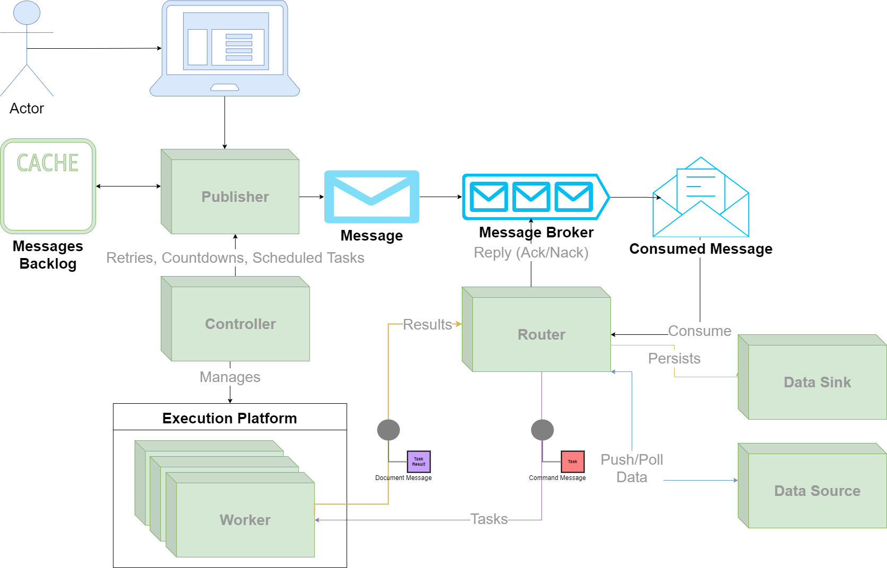

================================================
CEP XXXX: Celery NextGen High Level Architecture
================================================

:CEP: XXXX
:Author: Omer Katz
:Implementation Team: Omer Katz
:Shepherd: Omer Katz
:Status: Draft
:Type: Informational
:Created: 2020-05-27
:Last-Modified: 2020-05-27

.. contents:: Table of Contents
   :depth: 4
   :local:

Abstract
========

When Celery was conceived, production environments were radically different from today.

Nowadays most applications are (or often should be):

* Deployed to a cloud provider's computing resources.
* Distributed (sometimes between data centers).
* :term:`Available <Availability>` or :term:`Consistent <Consistency>` (If we store state, we must pick one according to :term:`CAP Theorem`).
* :term:`Network Partition Tolerant <Partition Tolerant>`.
* :term:`Observable <Observability>`.
* Built with scalability in mind.
* Cloud Native - The application's lifecycle is managed using Kubernetes, Swarm, or any other scheduler.
* Heterogeneous - Microservices may be written in different languages.

Also, Celery lacks proper support for large scale deployments and some useful messaging architectural patterns.

Celery 5 is the next major version of Celery, and so we can break backward compatibility, even in significant ways.

As such, our next major version should represent the beginning of a paradigm shift
in the way we implement our task execution platform.
Future major versions will drastically change how Celery works.

This document provides a high-level overview of the new architecture for the next generation of Celery
major versions.

Specification
=============

.. note::
    From now on when we write Celery we refer to Celery NextGen.

    Whenever we refer to a previous major version of Celery we will specify the version number.

Diagram
-------

  High Level Architecture Diagram

Preface
-------

In Celery 4.x we had the following architectural building blocks:

- :term:`Message Broker`
- :term:`Result Backend`
- :term:`Celery Master`
- :term:`Celery Worker`
- :term:`Celery Beat`

In addition we had a few optional architectural building blocks (some of them maintained by the community):

- :term:`Celery Multi`
- :term:`Flower`
- :term:`Cell`

The only architectural building block that remains in Celery is the :term:`Message Broker`.
The rest are replaced by new ones which provide more functionality and flexibility for our users.

In the rest of this specification we will describe the architectural building blocks of Celery.

Message Types
-------------

In Celery 4.x we only have tasks which are serialized to :term:`Command Messages <Command Message>`
that we publish to the :term:`Message Broker` whenever we want to
execute a :term:`Task`.

:term:`Document messages <Document Message>` are the messages we got as a result.
Those message were stored in the :term:`Result Backend`.
They had a specific format which only the Celery 4.x library knew how to parse.

In Celery, we now have new types of messages we can use.

:term:`Document Messages <Document Message>` may now also be produced whenever
we publish a serialized representation of a :term:`Domain Model` to the :term:`Message Broker`.
These messages may be received from a `Data Source <Data Sources>`_ or published directly
from the application.

:term:`Event Messages <Event Message>` are a new concept for Celery.
They describe that a :term:`Domain Event` occurred.
Multiple tasks can subscribe to an event.
Whenever we receive an :term:`Event Message` we publish those tasks as
:term:`Command Messages <Command Message>` to the :term:`Message Broker`.

These fundamental architectural building blocks will aid us in creating a better messaging
system. To encourage :term:`Ubiquitous Language`, we will be using them in this
document when applicable and in Celery's codebase as well.

Message Broker
--------------

In Celery 4.x each :term:`Celery Master` connected to only one :term:`Message Broker` cluster.

This is no longer the case.
Celery now allows connecting to multiple :term:`Message Brokers <Message Broker>`
even if they are of clusters that use different implementations of a message broker.

Users can consume messages from a Redis cluster, a RabbitMQ cluster, and an ActiveMQ cluster if they so desire.

This feature is useful when, for example:

- The user migrates from a legacy system that uses other implementation of a :term:`Message Broker`, but the new system uses a more modern one.
- The user wants to split the load between clusters.
- There's a security reason to publish some messages to a specific cluster.

On some :term:`Message Broker` implementations the `Controller`_ will assist in managing the cluster.

Data Sources & Sinks
--------------------

In Celery 4.x we had a :term:`Result Backend` which was used to store task results and coordinate
the execution of chords.

We extend the :term:`Result Backend` concept further to allow new use cases such:

- :term:`ETL`.
- :term:`Data Integration`.
- Reporting.
- Taking action when data is inserted or updated.

In addition, like we did for the `Message Broker`_, we now allow multiple data sources and sinks
instead of one cluster of a :term:`Result Backend`.

The responsibility for coordination of the execution of chords has moved to the `Execution Platform`_.

Data Sinks
~~~~~~~~~~

A data sink is where task results are saved.

A task result may be saved in more than one data sink (e.g. a Kafka Topic and S3).

The `Router`_ is responsible for routing task results to the correct data sink(s) and properly
serializing them.

Data Sources
~~~~~~~~~~~~

A data source is a anything that stores data.
It can be a Kafka topic, a S3 bucket, a RDBMS or even your local filesystem.

Some data sources can notify Celery of incoming data.
Others, Celery needs to poll periodically using the `Task Scheduler`_.

The `Router`_ is responsible for listening to incoming data from the various data sources
connected to it.

Whenever the Router receives incoming data it sends a :term:`Document Message` to the
`Publisher`_ which in turn will publish it to the :term:`Message Broker`.

Controller
----------

In Celery 4.x we provided a basic tool for controlling Celery instances called :term:`Celery Multi`.
We also provided :term:`Celery Beat` for periodically scheduling tasks.

The Controller replaces those two components and extends their functionality in many ways.

The Controller is responsible for managing the lifecycle of all other Celery
components.

Celery is a complex system with multiple components and will often be
deployed in high throughput, highly available, cloud-native production systems.

The introduction of multiple components require us to have another component
that manages the entire Celery cluster.

Instead of controlling Celery instances on one machine in a way that is agnostic to the production environment we're
operating in the Controller now provides a `Platform Manager`_ which manages Celery instances on one or many
machines.

The Controller also manages and optimizes the
execution of tasks to ensure we maximize the utilization of all our resources
and to prevent expected errors.

That is why the Controller is now responsible for auto-scaling Celery instances, rate-limiting tasks,
task concurrency limitations, task execution prioritization and all other management operations a
user needs to operate a Celery cluster.

Platform Manager
~~~~~~~~~~~~~~~~

The Platform Manager is responsible for interacting with the production environment.

The platform itself can be anything Celery can run on e.g.: Pre-fork, SystemD, OpenRC, Docker, Swarm, Kubernetes, Nomad.

Each implementation of the Platform Manager will be provided in a different package.
Some of them will be maintained by the community.

Foreman
~~~~~~~

The Foreman is responsible for deploying & managing the lifecycle of all Celery instances and ensuring
they stay up and running.

It can spawn new instances of Celery processes, stop or restart them either on demand or based on policies
the user has specified for auto-scaling.

It interacts with the `Platform Manager`_ to do so.

On some platforms, the Foreman can instruct the `Platform Manager` to deploy and manage the
lifecycle of :term:`Message Brokers <Message Broker>`.

Task Scheduler
~~~~~~~~~~~~~~

Publisher
---------

Router
------

Execution Platform
------------------

Motivation
==========

We want to modernize Celery for the Cloud Native age.
We need to keep Celery relevant for our users and help them in new ways. Therefore, we must adjust and evolve to meet the unique challenges of the Cloud Native age.

Also, we want to modernize the code to support Python 3+, which will allow us to remove workarounds, backports, and compatibility shims.
Refactoring the codebase to support Python 3+ allows us to keep a slimmer, more maintainable codebase.

Furthermore, we'd like to resolve long-standing design bugs in our implementation.

Gradually evolving our codebase is currently not possible due to the many changes
in technology since Celery was conceived.
We need to move fast and break things until we match all our goals.

Rationale
=========

Backwards Compatibility
=======================

Reference Implementation
========================

Copyright
=========

This document has been placed in the public domain per the Creative Commons
CC0 1.0 Universal license (https://creativecommons.org/publicdomain/zero/1.0/deed).
