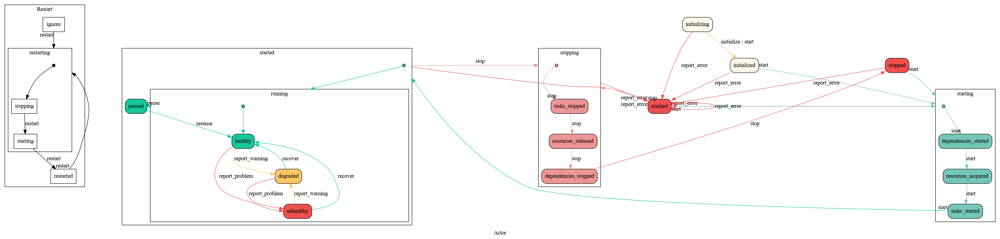

======================
CEP XXXX: Jumpstarter
======================

:CEP: XXXX
:Author: Micah Lyle
:Implementation Team: Omer Katz
:Shepherd: Omer Katz
:Status: Draft
:Type: Feature
:Created: 2021-05-09
:Last-Modified: 2021-05-09

.. contents:: Table of Contents
   :depth: 3
   :local:

Abstract
========

Since Celery was conceived over a decade ago, the Python landscape has evolved
considerably. Of the key recent developments has been the introduction and successive
improvements of Python's ``async/await`` support, with the growing ecosystem surrounding
its asynchronous/concurrent programming paradigm.

When Celery was initially built, it was very innovative and forward/future-thinking for its time.
It had (and still has) its own event loop implementation, and supported top-of-the-line
asynchronous programming models of the time, such as ``gevent`` and ``eventlet``.

Enter the start of the 2020s decade and Python, along with its ``async/await`` ecosystem
has been rapidly growing and thriving, providing a number of advancements improving
Python's asynchronous/concurrent programming model.

Currently, Celery does not natively support ``async/await``, either with queueing or
waiting on the result of tasks, like ``await some_task.apply_async(...)``, nor the usage
of ``async def`` and ``await`` from within tasks themselves. For example, without using
some custom written code of your own or a newer community-supported project like
`Celery Pool AsyncIO`_, you cannot define a task with ``async def`` nor can your task
(because it's not defined with ``async def``) do something like ``await
some_async_fn(...)`` unless within your task you booted up a modern ``async/await``
compatible event loop or used some other workaround.

That leads this CEP, whose purpose is to provide a foundational asynchronous programming
framework for the broader Python community modeled after the `Actor Model`_, and also
provide a foundation for `Next-Gen Celery`_ to be built upon. This will, down the line:

1. Allow awaiting on an asynchronous task results:

  .. code-block:: python

  await some_task.apply_async(args=(1,2), kwargs={"kwarg1": 3 })

2. Allow definining ``async`` tasks that can utilize ``await``, ``async with``, and all
the other features of Python's ``async/await`` programming model.

  .. code-block:: python

  @task
  async def my_task(...):
    x = await some_async_fn1(...)
    async with (...):
      y = await some_async_fn2(...)

Specification
=============

Jumpstarter is a Python implementation of an `Actor System`_ (which utilizies the `Actor Model`_). There
are three fundamental axioms within the actor model (quoting the previous Wikipedia link): 

  An actor is a computational entity that, in response to a message it receives, can *concurrently* (emphasis ours):

  1. Send a finite number of messages to other actors;
  2. Create a finite number of new actors;
  3. Designate the behavior to be used for the next message it receives.

It's important to remember that, although that is the technical definition of the actor, the interpretation and implementation of Actors and Actor Systems can be very flexible. Namely, what constitutes a "message" and "state" is very much up to the interpretation of the developer(s) and the system(s) they're using.

In Jumpstarter, we've chosen to take direct/literal approach to 3., modeling the state of an Actor using an actual state machine abstraction, namely a `Hierarchical State Machine`_. The difference between a standard State Machine and a Hierarchical State Machine is that a standard State Machine is consistent from states and transitions between them, but in an Hierarchical State Machine, states can also have their own sub-state machines. Hierarchical State Machines help both tame the complexity of large (non-hierarchical) state machines and more clearly model the relationships and transitions between them. To give an example with Jumpstarter, we propose only a small number of parent states:

* Initializing --> The initial state of the Actor when created.
* Initialized --> The state of the actor when we start it for the very first time.
* Starting --> The state of the actor immediately after calling ``actor.start()``. We'll have to transition through a number of substates of ``starting`` first (like starting dependencies, acquiring resources, and starting tasks), which we'll explain in more detail below (think of this like powering on a computer. You typically have to wait a few seconds for the computer to set up its internal state nicely before its fully operational. It also needs to connect to internal and external devices, and be ready for operation, etc.).
* Stopping --> The state of the actor immediately after calling ``actor.stop()``. We'll have to transition through a number of substates of ``stopping`` first (like stopping tasks, releasing resources, and stopping dependencies), which we'll explain in more detail below (think of this like powering off a computer. You typically have to wait a few seconds for the computer to clean up its internal state nicely before it can fully shut down).
* Stopped --> The state of the actor after it has finished all of its ``stopping`` activities (think about how when you power off a computer).
* Crashed --> The state of the actor when an exception was raised during startup or shutdown.

Within those parent states, we have sub-states. For example:

* Starting

  * Dependencies Started --> The state of the actor after all of the actor's dependencies have been started.
  * Resources Acquired --> The state of the actor after all resources have been acquired.
  * Tasks Started --> The state of the actor after all tasks have been started.

* Started

  * Paused --> The state of the actor when all tasks are halted without shutting down the entire actor.
  * Running --> The state of the actor when all tasks are running.

    * Healthy --> The state of the actor when the actor is functioning properly.
    * Degraded --> The state of the actor when the actor is not functioning properly but is still able to perform some of its duties.
    * Unhealthy --> The state of the actor when the actor is temporarily not functioning.

* Stopping
  
  * Tasks Stopped --> The state of the actor after all tasks have been started.
  * Resources Released --> The state of the actor after all resources have been acquired.
  * Dependencies Stopped --> The state of the actor after all of the actor's dependencies have been started.

In order to effectively model these states in Python, we propose using the mature `transitions`_ library, along with the `transitions-anyio`_ library. This gives us:

1. Mature Hierarchical State Machine library support thanks to `transitions`_.
2. Asynchronous state machine transitions (opening up abilities for concurrency, parallelization, and the latest ``async/await`` python support that's part of the motivation of this CEP in the first place) with `AnyIO`_ (thanks to `transitions-anyio`_) to abstract away the specific event loop of choice (like `AsyncIO`_, `Trio`_, or potentially others in the future).
3. Native support within `transitions`_ for integrating with ``diagrams``/``graphviz`` to generate state machine diagrams (like the one below). Additionally, `transitions-gui`_ provides some interesting and promising capabilities for future Celery Flower-like projects to be able to visualize in a live, animated fashion the various Jumpstarter Actors and their states as transitions happen across all the various actors within the system.

For a high level view, the parent states, their substates, and the transitions between them can be seen in the diagram below:

Also, in that diagram you can also see the ``Restart`` state. We propose a separate state machine which we'll call *Actor Restart State Machine* that models the Actor's state as it relates to restarts:

* Ignore --> A special state which is ignored by the Actor (effectively meaning we're not in any sort of restart state).
* Restarting --> The state of the actor once it has begun restarting.

  * Stopping --> The state of the actor while stopping during a restart.
  * Starting --> The state of the actor while starting during a restart.

* Restarted --> The state of the actor after it has been restarted.

With these states and sub-states, for both the main state machine and the regular state machine, we provide a clear public API for code to hook into any part of the Actor's Lifecycle. Similar to how, for example, modern asynchronous frontend web frameworks like React and Vue provide hooks into the lifecycle of their components, `transitions`_ provides many different hooks to:

* Have code run before a transition occurs or a state is entered, or conditionally block a transition from happening if certain conditions aren't met.
* Have code run after a transition occurs (we could use this to, for example, fan out a result right before some hypothetical state ``"task_completed"`` is exited).
* Do many other things at various granularities and moments. See https://github.com/pytransitions/transitions#callback-execution-order for specific details on the order and timing of when specific callbacks are invoked.

With that base API, Jumpstarter provides a solid foundation and a lot of flexibility to help define self-contained pieces of business logic and facilitate communication between them while maintaining a separation of concerns.

For reference, the currently proposed transitions (as can be seen in the diagram above) are:

* ``initialize()`` -> Initializes the actor without starting it.
* ``start()`` -> 	Starts the actor.
* ``pause()`` -> 	Pauses the actor's tasks without shutting it down completely.
* ``resume()`` -> 	Resumes the actor's tasks after it has been paused.
* ``stop()`` -> 	Stops the actor.
* ``restart()`` -> 	Restarts the actor.
* ``report_error()`` -> 	Report that an error has occurred while starting or stopping the actor.
* ``report_warning()`` -> 	Report an issue with the actor which interferes with some of the actor's functionality.
* ``report_problem()`` -> 	Report an issue with the actor which causes the actor to be temporarily malfunctioning.
* ``recover()`` -> 	Recover from a degraded or unhealthy states.

Three abstractions Jumpstarter provides that are addressed in both the ``starting`` and ``stopping`` states are:

1. Dependencies
2. Resources
3. Tasks

Dependencies
------------
Actors may depend on other actors to run before starting themselves. In some cases, they must depend on another actor if an actor consumes messages from another actor's stream. In `Actor System`_ language, that means that the dependent actor is a parent actor, and the actor consuming messages from the parent actor is the child actor. Just the fact of depending on another actor means that messages will be passed from the parent actor to the child actor (the child actor can also have a way to pass messages back to the parent, but that's out of the scope of this CEP and is something that may be explored as the implementation of Producers and Consumers is more refined).

The proposed public API is as follows:

  .. code-block:: python
  from jumpstarter import Actor, depends_on

  class AccountBalanceActor(Actor):
    def __init__(self, user_id: int):
      self.user_id = user_id

  class AccountBookkeepingActor(Actor):
    def __init__(self, user_id: int, account_balance_actor: AccountBalanceActor):
      self._account_balance_actor = account_balance_actor

    @depends_on
    def account_balance_actor(self):
      # It's presumed here `account_balance_actor` is an already existing `AccountBalanceActor` instance.
      return account_balance_actor

In this example, the ``AccountBalanceActor`` maintains the balance in a single user ID's account. The ``AccountBookkeepingActor`` is responsible for logging and auditing withdrawals and income, possibly passing these audit logs to another actor responsible for detecting fraud.

Instead of returning an already existing *instance* of an ``AccountBalanceActor`` in ``@depends_on``, you can also:

1. Use a factory method to initialize a brand new ``AccountBalanceActor`` instance (since every actor must inherit from ``Actor`` we'll define some helpful factory methods in ``Actor`` which can be used by all subclasses/instances).
2. Return a subclass of ``Actor`` and it will be initialized for you, proiding all the arguments are available for that actor. This uses the `Inversion of Control`_ pattern. How this works will be left as an implementation detail, but Jumpstarter, given that it knows each ``Actor``'s dependencies and has them all in a graph should be able to satisfy dependencies and inject arguments as long as it's able to find them in an accessible way.

Resources
---------
Actors have resources they manage during their lifetime, such as:

* Connections to databases and message brokers
* File Handles
* Synchronization Mechanisms (useful for short-lived actors)

A resource can be an asynchronous context manager or a synchronous context manager. It's entered whenever the Actor is ``starting``, specifically just before the state machine transitions to the ``starting -> resources_acquired`` state.
It is exited whenever the Actor is stopping, specifically just before the state machine transitions to the ``starting -> resources_released`` state. Given the asynchronous nature of Jumpstarter, resources can be released concurrently (even if there are synchronous resource releases that are run, say, in a thread pool). Additionally, any and every actor, once resources are acquired, will be have `cancel scope`_ (acquired once ``starting -> resources_acquired`` state has been entered) in the that can be used to shut down the worker or cancel any running task(s), whether because of a timeout, a crash, a restart, or some other reason. Even if the task is run in a thread pool, the `cancel_scope` and fact that the Jumpstarter is running in an event loop means that more robust cancellation of tasks may be possible in future versions of Celery than have been up to this point (see `Nathaniel Smith's (of Trio) blog <https://vorpus.org/blog/timeouts-and-cancellation-for-humans/>`_ for some helpful background on this).

The proposed public API is as follows:

  .. code-block:: python
  from pathlib import Path

  from jumpstarter import Actor, resource

  class FileHeadActor(Actor):
    def __init__(self, file_path: Path):
      self.file_path = file_path

    @resource
    def log_file(self):
      return open(file_path)

Tasks
-----
An actor repeatedly runs tasks to fulfill its purpose. Using tasks, the user implements the business logic of the Actor. A task can be asynchronous or synchronous. If the task is synchronous, the task is run in a thread pool. If it is asynchronous, the task runs using the event loop.

The proposed public API is:

  .. code-block:: python
  from pathlib import Path

  from jumpstarter import Actor, task
  from jumpstarter.tasks import Success

  class CountingActor(Actor):
    def __init__(self):
      self.i: int = 0

    @task
    def count_to_ten(self):
      self.i += 1
      print(self.i)

      if self.i == 10:
        return Success()

When you start the actor, specifically before the transition to ``starting -> tasks_running``, the ``count_to_ten`` method is repeatedly called until you ``stop`` the actor (which in turn triggers the cancel scope). This actor counts to 10 and prints the current count. When it reaches 10, the task stops running as it was successful.

There are two types of tasks: continuous and periodic. There may be more types of task in the future that either Jumpstarter defines or future Celery-related libraries that work with Jumpstarter define. Regardless, Jumpstarter's public API will enable lots of flexibility for working with tasks and even defining new task types. To give a theoretical example: Consider a type of task called a **A/B Task**. Since most things in Jumpstarter are extendable, we could extend the task states to include two new states:

1. ``started -> running -> healthy -> A``
2. ``started -> running -> healthy -> B``

Now, suppose we have an actor called ``ProvideAutocompleteSuggestion`` whose job is to take in some search query and return some autocomplete suggestions. Maybe we have a new autocomplete engine we'd like to A/B test, with 5% of the queries going to the "B" test to see how the new engine is performing, eventually ramping up to 50/50 and maybe eventually replacing it. We could hook into Jumpstarter to, when tasks transition to ``started -> running -> healthy``, either then transition into the ``A`` substate or ``B`` substate with given probability, and then have conditional task(s) that
run depending on whether we're in the ``A`` substate or the ``B`` substate.

Motivation
==========

There are two primary motivations to discuss.

1. The motivation to build `Jumpstarter`_.

2. The motivation to, down the line, use `Jumpstarter`_ as a foundation for parts of
`Next-Gen Celery`_.

For the first motivation, one of Celery's main use cases is to build asynchronous,
distributed systems that communicate via message passing. The `Actor Model`_, which has
been around for almost half a century is a tried and tested way to design and build
large-scale concurrent systems. It very much matches what Celery aims to do and has
shown to have great success in projects like `Akka`_ and many others. The `Actor Model`_
also works great with Python's ``async/await`` support as messages are able to be
asynchronously sent and awaited upon very efficiently.

`Jumpstarter`_ comes in to fill the spot of being that fundamental/primititve library to
build `Next-Gen Celery`_ on top of, while simultaneously being a modern implementation
and interpretation of the `Actor Model`_ (and an `Actor System`_, or at least blocks for
building one) in Python. For reasons why Celery would build its own library instead of
using an existing Actor framework in Python, see the :ref:`Rationale` below.

For the second motivation, certain bugs and issues in Celery resolve around things like
chord synchronization/counting errors, very hard to reproduce concurrency issues, canvas
edge cases, etc. Looking at these issues from a higher perspective and the current state
of the codebase, future versions of Celery could benefit from code that adheres to
something like the `Actor Model`_, which really helps to eliminate race conditions,
locking issues, shared state issues, and other things like that which are out of the
scope of this document.  Modeling workers, tasks, canvas primitives, and other Celery
components after an `Actor System`_ and making them hold to the fundamental axioms of
the `Actor Model`_ will encourage code that is far more Single Responsibility Principle
(SRP) than the current codebase is, and encourage both designs and implementations that
are easier to reason about, easier to test, and easier to extend and work with. The
design of various Celery components using `Jumpstarter`_ primitives is outside of the
scope of this document and would be addressed in future CEPs.

Rationale
=========

A quick internet search of Python actor libraries and packages returns a
few different results. Before listing some of those libraries, the main
reasons for building our own `Actor Model`_ implementation are as follows:

1. We want a framework that is built with and for ``async/await`` from the beginning, and
that takes advantage of all the latest abstractions and innovations in Python's
``async/await`` support and the latest general language features as well (like
``typing`` and other things). Many of the other frameworks listed below were built
either before ``async/await`` or in the earlier stages. 

2. We want something that can be a standalone framework, but that can _also_ be informed by
the needs of `Next-Gen Celery`_. Hence, we'd like for the Celery organization to
maintain and shepherd the project. We may find that we need to make changes rapidly in
the beginning, and we'd like to see the project evolve and grow quickly without being
blocked by other large dependent projects (like some or many of these other libraries
may be), especially in the beginning. By Celery creating a new library, we can both
enable rapid development of `Jumpstarter`_ and `Next-Gen Celery`_ now and down the line, while
still providing a framework that the greater Python community may find helpful to build
other projects off of.

With that being said, let's take a look at a few existing projects:

* `Pykka`_ is a Python-based actor that was extracted originally from `Mopidy`_, an "extensible music server written in Python". We wouldn't use `Pykka`_ for two main reasons:

  * It doesn't support ``async/await`` currently, and hasn't supported it from the beginning.
  * It powers `Mopidy`_, and probably a number of other significant projects rely on it to some extent, so it wouldn't make sense to rely upon it for reasons listed above.

* `Cell`_ was an earlier attempt at an actor model/framework for Celery. It wasn't very widely used and developed.

  * Given reason #1 above, it makes sense to archive `Cell`_ and move forward with `Jumpstarter`_ (`comment <https://github.com/celery/jumpstarter/issues/1#issuecomment-755347761>`_).

* `Thespian`_ is a very rich-featured "Python Actor concurrency library." Of all the libraries listed, it would seem the most promising for something to use and/or build off, of, except that:

  * It seems to have been built out before the early ``asyncio`` ``async/await`` phase of Python's development. The ``async/await`` syntax wasn't quite around yet, and libraries like `Curio`_ and `Trio`_ weren't around yet. Python's asynchronous programming model has come a long way since the 3.3/3.4 and early ``asyncio`` days. Along with reason #1 above, we really want to support some of the newer asynchronous ideas (and use them as a base) with `Jumpstarter`_. Given the large size of `Thespian`_'s codebase, it would be very seemingly impractical to try and tweak an aircraft carrier (metaphorically speaking) to fit our use cases.
  * The library seems to have been in maintenance mode for the last few years. It was originally built in house at GoDaddy, and the original author does not work there anymore.  Scanning the release history shows more maintenance releases than new activity, which, given its large size, possibly external large-project dependencies, and reason #2 above, makes us inclined to still build our own framework. That being said, there may be useful things that can be learned from `Thespian`_, whether high level structure or low level details.

* `Pulsar`_ is an "Event driven concurrent" framework for Python. It's goal, according to its README, "is to provide an easy way to build scalable network programs." It was built upon ``asyncio`` from the Python3.5+ days and supports ``async/await``. However, while it has a number of powerful and interesting features, it has been archived by its owner, so discussing it more does not feel necessary for the scope of this document.

  * Additionally, while it does seem to have great support for building generally network connected programs, a number of examples show how to use it to build something like a non-blocking ``wsgi`` server. Celery does intend to handle such use cases, especially given the development of the ``asgi`` specification, and many other modern libraries under current development that are doing a great job with ``asgi``. Similar to what was said about `Thespian`_, there may be useful things that can be learned from `Pulsar`_, but it's not something that we think should be built upon, for similar reasons to `Thespian`_ above, along with our general reasons #1 (``asyncio`` only would not satisfy that) and #2 (`Pulsar`_ seems to have been by and potentially for a group called `Quantmind <https://quantmind.com/>`_).

Backwards Compatibility
=======================

Given that `Jumpstarter`_ is a library being built from scratch, there isn't too much to
talk about on the backwards compatibility side of things. It's an open discussion at the
moment of we should support Python 3.7+ or Python 3.10+. It might be nice, given
``trio``, ``asyncio``, and other ``async/await``/event loop implementation improvements
in the last number of Python versions to rely on 3.10+. And on top of that, we'd get the
latest improvements in the ``typing`` world, and pattern matching that we could use from
the beginning.

Reference Implementation
========================

The `Reference Implementation`_ has a nice sketch of how actors might look in
`Jumpstarter`_. Some of the kinks and details are still being worked out, but
that's the place to go and start taking a look at the time of writing. Further
buildout of certain aspects of the reference implementation (which are also
related to `Celery Next-Gen`_) may be blocked or waiting on some third-party
library support. One example is we're waiting for an `APScheduler 4.0
Release`_.

Copyright
=========

This document has been placed in the public domain per the Creative Commons
CC0 1.0 Universal license (https://creativecommons.org/publicdomain/zero/1.0/deed).

.. Next-Gen Celery https://github.com/celery/ceps/blob/master/draft/high-level-architecture.rst
.. Jumpstarter https://github.com/celery/jumpstarter
.. Reference Implementation https://github.com/celery/jumpstarter/tree/actor
.. AP Scheduler 4.0 Release https://github.com/agronholm/apscheduler/issues/465
.. Next-Gen Rationale https://github.com/celery/ceps/blob/master/draft/high-level-architecture.rst#rationale
.. Actor Model https://en.wikipedia.org/wiki/Actor_model
.. Actor System https://doc.akka.io/docs/akka/current/general/actor-systems.html
.. Celery Pool AsyncIO https://github.com/kai3341/celery-pool-asyncio
.. Akka https://akka.io/
.. Pykka https://github.com/jodal/pykka
.. Mopidy https://github.com/mopidy/mopidy
.. Cell https://github.com/celery/cell
.. Thespian https://github.com/thespianpy/Thespian
.. Pulsar https://github.com/quantmind/pulsar
.. AsyncIO https://docs.python.org/3/library/asyncio.html
.. Curio https://github.com/dabeaz/curio
.. Trio https://github.com/python-trio/trio
.. Trio-Asyncio https://github.com/python-trio/trio-asyncio
.. Hierarchical State Machine https://www.eventhelix.com/design-patterns/hierarchical-state-machine/
.. transitions https://github.com/pytransitions/transitions
.. transitions-anyio https://github.com/pytransitions/transitions-anyio
.. transitions-gui https://github.com/pytransitions/transitions-gui
.. AnyIO https://github.com/agronholm/anyio
.. cancel scope https://anyio.readthedocs.io/en/stable/api.html#anyio.CancelScope
.. Inversion of Control https://martinfowler.com/bliki/InversionOfControl.html
